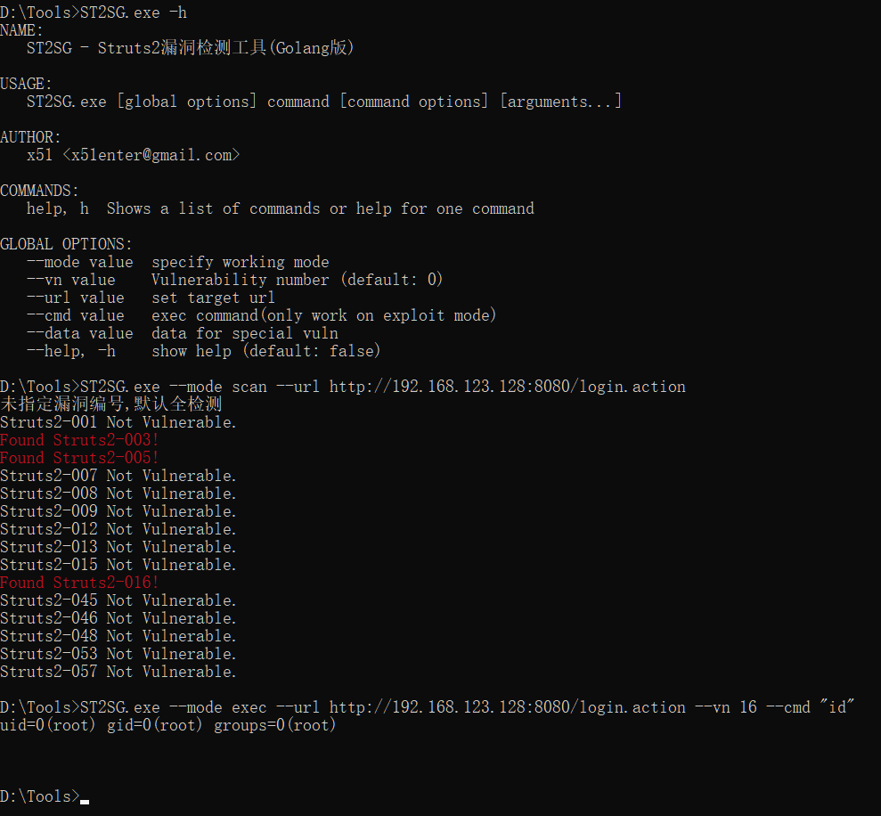

# STS2G
Struts2漏洞扫描Golang版，POC参考了众多优秀项目如[Struts2-Scan](https://github.com/HatBoy/Struts2-Scan)，漏洞测试采用[vulhub](https://github.com/vulhub/vulhub/tree/master/struts2).  
目前两种模式`scan`和`exec`支持：  
*struts2-001*
*struts2-003*
*struts2-005*
*struts2-007*
*struts2-008*
*struts2-009*
*struts2-012*
*struts2-013*
*struts2-015*
*struts2-016*
*struts2-045*
*struts2-046*
*struts2-048*
*struts2-053*
*struts2-057*
#### 开发目的  
1、该工具适用于命令行操作模式下，比如webshell下检测内网struts2漏洞.  
2、Golang可编译Win/Linux可执行文件.  
3、单文件运行.  
#### 使用方法  
``` 
NAME:
   ST2SG - Struts2漏洞检测工具(Golang版)

USAGE:
   ST2SG.exe [global options] command [command options] [arguments...]

AUTHOR:
   x51 <x51enter@gmail.com>

COMMANDS:
   help, h  Shows a list of commands or help for one command

GLOBAL OPTIONS:
   --mode value  specify working mode
   --vn value    Vulnerability number (default: 0)
   --url value   set target url
   --cmd value   exec command(only work on exploit mode)
   --data value  data for special vuln
   --help, -h    show help (default: false)
```
  
##### 默认扫描模式:  
```ST2SG --mode scan --url http://xxx.com/index.action```  
##### 指定漏洞扫描模式：  
```ST2SG --mode scan --url http://xxx.com/index.action --vn 16```  
##### 命令执行模式：  
```ST2SG --mode exec --url http://xxx.com/index.action --vn 16 --cmd "whoami"```  
##### 自定义参数模式：  
*该模式基于以上方法，分有两种情况，自定义GET参数名，和自定义POST数据包内容，POST方式需要在数据包中指定一下要测试的参数并用fuckit标记出来.*  
POST  
```ST2SG --mode scan --url http://xxx.com/index.action --vn 007 --data "name=fuckit&pass=qwer"```  
GET  
```ST2SG --mode scan --url http://xxx.com/index.action --vn 009 --data "name"```  
#### 待补充  
*上传Webshell功能*  
*完善webppath打印模块-目前实现一部分*
